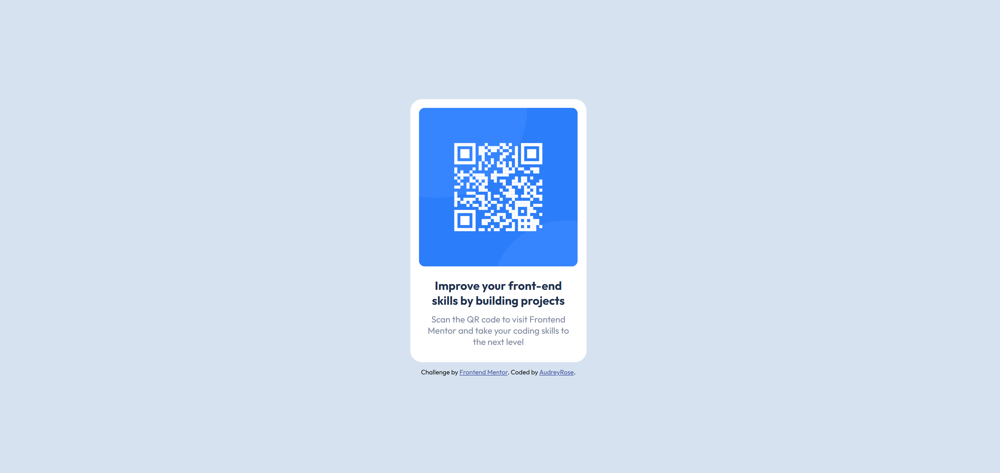

# Frontend Mentor - QR code component solution

This is a solution to the [QR code component challenge on Frontend Mentor](https://www.frontendmentor.io/challenges/qr-code-component-iux_sIO_H). Frontend Mentor challenges help you improve your coding skills by building realistic projects.

## Table of contents

- [Overview](#overview)
  - [Screenshot](#screenshot)
  - [Links](#links)
- [My process](#my-process)
  - [Built with](#built-with)
  - [What I learned](#what-i-learned)
  - [Continued development](#continued-development)
- [Author](#author)

## Overview

### Screenshot

### Links

- Solution URL: [My Frontend Mentor Solution Page](https://www.frontendmentor.io/solutions/simple-implementation-of-qr-code-component-aSkfJI1wc-)
- Live Site URL: [Check Out the Live Site!](https://audreyrose-wooden.github.io/QR-Component/)

## My process

### Built with

- Semantic HTML5 markup
- CSS custom properties

### What I learned

The QR Code Component is my first Frontend Mentor Project. Other than the color codes provided in the Style Guide, I had to approximate shapes, positions, padding, etc. I tried to keep this project simple and only use HTML and CSS so I could focus on translating design to code.

### Continued development

In future projects I want to try to incorporate FlexBox and Styled Components. Otherwise, I just want to continue working on being more comfortable with styling based off of someone else's design.

## Author

- Frontend Mentor - [@AudreyRose-Wooden](https://www.frontendmentor.io/profile/AudreyRose-Wooden)
- LinkedIn - [AudreyRose Wooden](https://www.linkedin.com/in/audreyrose-wodoen)
